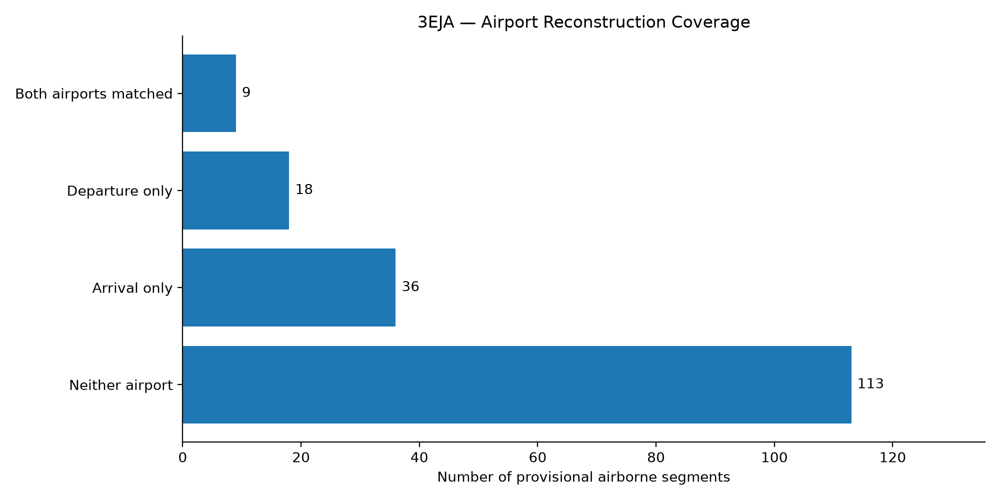

# 3EJA Aircraft Tracking Reconstruction

**Python | DuckDB | SQL | Folium | Matplotlib**

## Research Question

Which flights and airport routes can we reconstruct for aircraft listed under FAA certificate `3EJA`, and where is tracking incomplete?

## Project Overview

This project analyzes publicly available ADS-B observations for October 2, 2026, using adjacent-day records where necessary to investigate midnight crossings.

The workflow combines Python data collection, DuckDB SQL reconstruction, validation checks, and interactive visualizations.

The analysis distinguishes between observed tracking positions, provisional airborne segments, and candidate airport routes. It does not assume that every airborne segment represents a complete flight.

## Data Pipeline

1. Identify aircraft associated with certificate `3EJA` using registry data.
2. Download tracking observations using `download_tracking.py`.
3. Collect adjacent-day observations using `download_boundaries.py`.
4. Load and process observations in DuckDB.
5. Clean and inspect tracking records.
6. Reconstruct provisional airborne segments using SQL.
7. Validate segment continuity and endpoint consistency.
8. Match candidate departure and arrival airports.
9. Export final reconstruction results.
10. Generate maps and coverage charts using Python.

The SQL reconstruction pipeline is documented in `reconstruction.sql`.

## Python Scripts

| Script | Purpose |
|---|---|
| `load_fleet.py` | Fleet preparation |
| `download_tracking.py` | Primary-date tracking downloads |
| `download_boundaries.py` | Adjacent-day tracking downloads |
| `map_flights.py` | Original observed tracking visualization |
| `map_validated_routes.py` | Candidate airport-pair visualization |
| `plot_reconstruction_coverage.py` | Airport reconstruction coverage chart |
| `rank_operators.py` | Supporting operator-ranking script |

## Reconstruction Methodology

Airborne observations are divided into provisional segments using a conservative 120-second tracking-gap threshold.

Candidate airport endpoints are matched using nearby observed ground positions and airport reference locations.

The endpoint matching procedure uses a 120-second ground-observation window and a 5 km airport proximity threshold.

These rules support provisional reconstruction, not definitive identification of complete flights.

## Results

| Reconstruction status | Segments |
|---|---:|
| Both airports matched | 9 |
| Departure only | 18 |
| Arrival only | 36 |
| Neither airport matched | 113 |
| **Total** | **176** |

The validated dataset includes 176 provisional airborne segments across 43 aircraft.

Automated checks found no overlapping segments, duplicate endpoint groups, or internal tracking gaps greater than 120 seconds after segmentation.

Only 9 segments have candidate airports matched at both endpoints.

## Visualizations

### Candidate Airport Pairs

Open `validated_routes_map.html` to explore the candidate airport connections.

The dashed lines represent straight-line airport connections, **not observed flight tracks**.

### Reconstruction Coverage

### Original Tracking Map

Open `flight_map.html` to explore the earlier observed-position visualization.

This map uses the original `flight_points.csv` input rather than the final validated segmentation.

## Project Outputs

- `reconstruction.sql` — SQL reconstruction and validation
- `mart_3eja_reconstruction_202610081525.csv` — Final segment-level results
- `validated_routes_map.html` — Interactive candidate airport-pair map
- `reconstruction_coverage.png` — Reconstruction coverage chart
- `flight_map.html` — Original tracking visualization

## Limitations

- Public ADS-B observations may be incomplete.
- Tracking gaps do not necessarily indicate separate physical flights.
- Missing ground observations limit airport endpoint identification.
- Candidate airport pairs are not independently verified completed flights.
- Airport-pair feasibility requires further duration and distance validation.
- ADS-B data does not establish passengers, flight purpose, or repositioning activity.

## Conclusion

This project demonstrates how Python and SQL can be combined to reconstruct observable aircraft activity while explicitly identifying gaps and uncertainty.

The central finding is that detecting airborne segments is not equivalent to reconstructing complete airport-to-airport flights.
